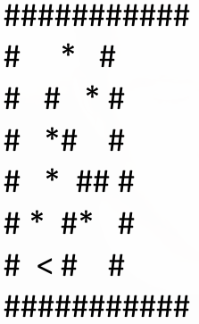

# Aufgabe 6.1 - Hamsterprogramm

Sie programmieren einen virtuellen Hamster.
Unser Hamster befindet sich auf einer 2-D Karte. Diese Karte kann wie folgt aussehen:

Durch die Benutzereingaben steuern Sie den Hamster durch das Spielfeld. Folgende Funktionen besitzt unser Hamster.

1. Links drehen
2. Rechts drehen
3. Vorwärts gehen
4. Anzahl gefressener Körner ausgeben

Bedeutung der Feldtypen:
- '#' = Mauer (Hamster kann dieses Feld nicht betreten)
- '*' = Korn (Hamster isst diese Körner auf, wenn er auf dieses Feld kommt)
- '<,^,>,v' = Der Hamster mit seiner aktuellen Laufrichtung

### Hinweise:
Lösen Sie die Aufgabe objektorientiert (Aufteilung in mehrere Klassen, die jeweils nur die für Sie vorgesehenen Anforderungen umsetzen)! 
Lösungen, welche z.B. nur aus einer Klasse bestehen, werden nicht als korrekte Umsetzung angesehen.